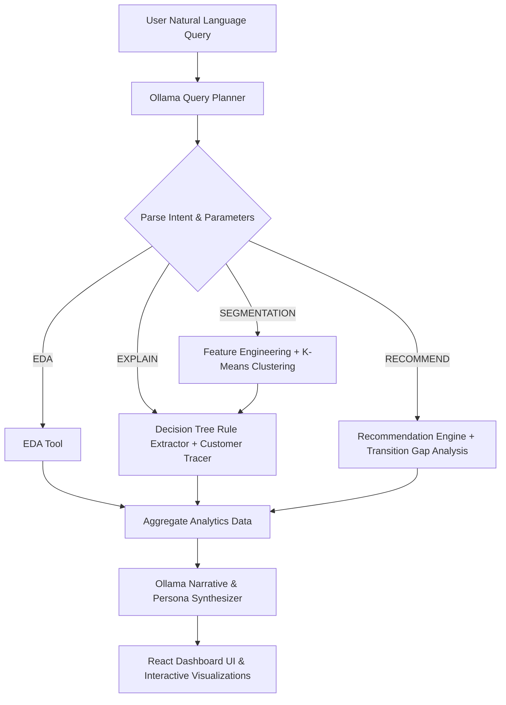

# Customer Segmentation & Personalization Agent for Retail Banking

An AI-powered agentic system designed to help retail banks move away from generic marketing. The agent autonomously parses natural language queries, executes an analytics pipeline (EDA, feature scaling, K-Means clustering, decision tree boundary rule extraction, product recommendation mapping), and synthesizes actionable personas and cross-selling campaigns using a local **Ollama LLM (Llama 3.2)**.

---

## 📌 Problem Statement
Retail banks offer a wide range of financial products (savings accounts, credit cards, personal loans, investment services). However, applying broad, one-size-fits-all marketing strategies leads to low customer engagement and suboptimal product adoption. 

This solution provides a **Query-Driven Agentic System** that simulates how a bank's analytics team operates:
1. Performs automated Exploratory Data Analysis (EDA) on customer records.
2. Segments customers based on behavioral and financial attributes.
3. Extracts human-interpretable segment decision rules (Explainability).
4. Recommends personalized banking products and transition strategies for each customer segment.
5. Operates 100% locally and offline.

---

## 🤖 Agent Architecture & "Agentic" Workflow

The agent does **not** rely on a one-shot LLM answer. Instead, it follows a multi-step orchestrated pipeline:



### Core Backend Tools:
1. **EDA Tool (`agent_backend/eda_tool.py`):** Calculates statistical distributions, missing values, correlation matrices, and prepares scatter plot data.
2. **Feature Engineering Tool (`agent_backend/feature_engineering_tool.py`):** Performs feature scaling (StandardScaler), categorical one-hot encoding, and derives financial indicators (e.g. balance-to-income ratio, investment ratio).
3. **Segmentation Tool (`agent_backend/segmentation_tool.py`):** Performs K-Means clustering or DBSCAN, evaluates density via Silhouette Score, and identifies edge cases (boundary customers and statistical outliers).
4. **Explainability Tool (`agent_backend/explainability_tool.py`):** Fits shallow Decision Tree classifiers to extract readable decision boundaries (e.g., `IF account_balance > 45000 AND transaction_frequency > 12 -> Priority`) and traces individual customer classification paths.
5. **Recommendation Engine (`agent_backend/recommendation_tool.py`):** Maps segments and individual customer metrics to financial products (Credit Card upgrades, Wealth Advisory, Debt Consolidation) and outlines concrete numeric steps to upgrade to Priority status.

---

## 📊 Dataset Information & Generation Logic

### Sourcing & Assumptions
Synthetic data generated via `data_generator.py` is used to model 5,000 retail banking customers across 5 realistic behavioral personas:
- **Priority Customers (15%):** High balance ($85k avg), high monthly transactions (25 avg), high income, high credit score.
- **Regular Customers (45%):** Moderate balance ($15k avg), active transaction count (12 avg), moderate credit score.
- **Dormant Customers (15%):** Low balance ($650 avg), extremely low transaction frequency (< 1/month), inactive online logins.
- **Overleveraged Customers (15%):** High debt-to-income ratio (0.75 avg), high credit card utilization (> 85%), low balance ($250 avg), frequent micro-transactions.
- **Wealth/Investor Customers (10%):** Very high balance ($260k avg), high income ($220k avg), high investment account balances ($160k avg), lower transaction frequency.

### Data Dictionary (`banking_customers.csv`)
| Column Name | Data Type | Description | Logical Bounds |
| :--- | :--- | :--- | :--- |
| `customer_id` | String | Unique customer identifier | e.g. `CUST0001` |
| `age` | Integer | Customer age | 18 – 85 years |
| `occupation` | String | Category (Professional, Retired, Self-Employed, etc.) | Categorical |
| `region` | String | Geographic region (North, South, East, West, Central) | Categorical |
| `annual_income` | Float | Annual income in USD | $1,000 – $300,000+ |
| `account_balance` | Float | Savings/checking account balance | $0 – $350,000+ |
| `transaction_frequency` | Integer | Number of transactions per month | 0 – 60+ |
| `avg_transaction_amount` | Float | Average dollar amount per transaction | $0 – $1,500+ |
| `credit_score` | Integer | Credit score rating | 300 – 850 |
| `debt_to_income` | Float | Ratio of monthly debt payments to income | 0.0 – 1.5 |
| `credit_card_limit` | Float | Credit card limit | $500 – $50,000 |
| `credit_card_utilization` | Float | Percentage of credit limit used | 0.0 – 1.05 (105%) |
| `online_login_frequency` | Integer | Monthly mobile/web logins | 0 – 30 |
| `tenure_months` | Integer | Account age in months | 1 – 240 |
| `has_personal_loan` | Binary | 1 if customer has active loan, 0 otherwise | 0 or 1 |
| `has_credit_card` | Binary | 1 if customer has active credit card, 0 otherwise | 0 or 1 |
| `has_investment_account` | Binary | 1 if active investment account, 0 otherwise | 0 or 1 |
| `investment_balance` | Float | Total investment asset balance | $0 – $250,000+ |

---

## 🛠️ Permitted Tools & Tech Stack

### Technology Stack:
- **Backend:** Python 3.10+, FastAPI, Uvicorn, Pandas, NumPy, Scikit-Learn, HTTPX, Python-Dotenv.
- **LLM / Local AI:** Ollama running **Llama 3.2 (3B)** locally on port `11434`.
- **Frontend:** React + Vite, Vanilla CSS (Glassmorphism dark theme, custom responsive grid, Outfit typography), Chart.js & React-Chartjs-2.

### AI Assistance Disclosure:
- Agentic coding tools were used to assist in scaffolding and test-driven development of analytics functions.
- All machine learning algorithms (K-Means, Decision Trees, StandardScaler) and API services run locally without external cloud API dependencies.

---

## 🚀 Setup & Execution Guide

### Prerequisites
1. **Python 3.10+**
2. **Node.js 20+**
3. **Ollama:** Install from [ollama.com](https://ollama.com) and pull the model:
   ```powershell
   ollama pull llama3.2
   ```

### 1. Installation & Environment Setup
Run the automated PowerShell setup script:
```powershell
powershell -ExecutionPolicy Bypass -File .\setup.ps1
```
*(This creates the `.venv` environment, installs backend dependencies, and builds the React frontend static bundle).*

### 2. Launching the System
Run the application launcher:
```powershell
powershell -ExecutionPolicy Bypass -File .\run.ps1
```
Open your browser and navigate to: **`http://localhost:8000`**

---

## 🧪 Verification & Testing Suite

You can execute the verification suite at any time to validate dataset integrity, clustering metrics, decision tree rules, and API routes:

```powershell
# Activate venv first:
.\.venv\Scripts\Activate.ps1

# 1. Test Dataset & Schema Boundaries:
python verify_stage1.py

# 2. Test Core Analytical Tools (EDA, Scaling, K-Means, Trees, Recs):
python verify_tools.py

# 3. Test Ollama Connectivity & LLM Plan Parsing:
python verify_orchestrator.py

# 4. Test FastAPI Server Endpoints:
python verify_stage4.py

# 5. Run Complete Integration Suite:
python verify_agent.py
```
